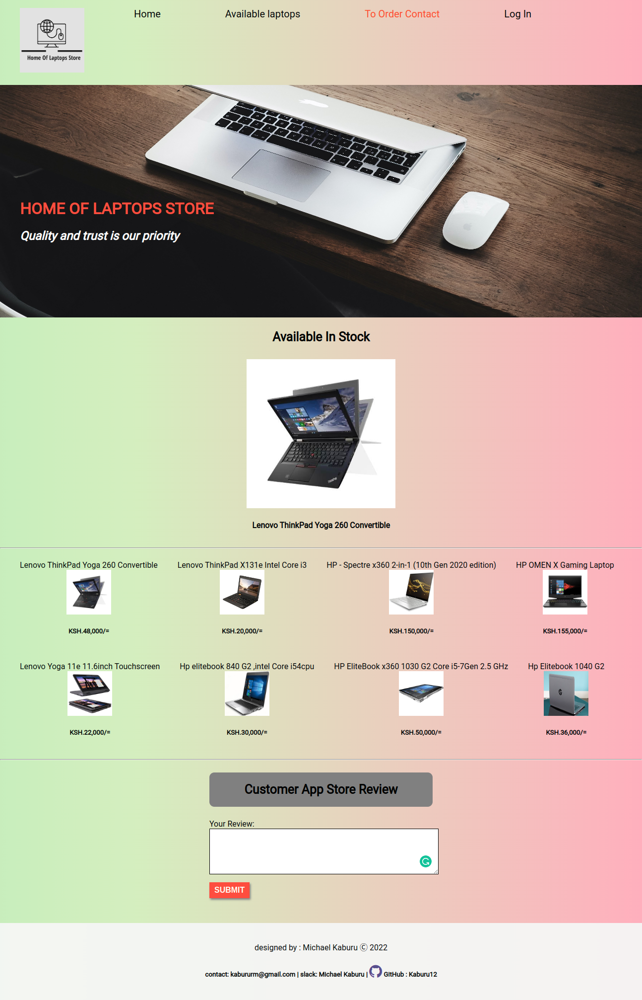

# Home Of Laptops Store
This is a laptop store app project .

## Description
The project uses the HTML ,CSS and JAVA SCRIPT languages to program this site and JSON for hosting a local public API. The laptop store has the following user interactivity :
1) A well designed landing page.
2) The app has a contact part on the nav bar that when clicked it give a contact alert.
3)The app has a laptop display section where available laptops are displayed with their details .The user can access more laptop details by just clicking on the name of the laptop and details are displayed. On the laptop details section ,there's a clear button that when clicked it clears the laptop details.
4) On the app one can also like a laptop.
5) The app also contains a review section where a customer can write a new review and submit it .Also the review can be deleted by clicking on it.

## Project-Setup-Instructions
1)Installation of the Visual studio code .
2)Git cloning the repository .
3)Make sure the live server extension is installed .
4)run the local server (JSON server) by running $: "json-server --watch db.json"  in the terminal.
5)Click on Go live .

## live-Link
https://kaburu12.github.io/Laptop-store-app/

## Live-Video-Link Of The Project's Functionality
https://drive.google.com/file/d/1UYHeGDh2RsSpqhsoJJ76NTIi7IFXPLYk/view?usp=sharing

## Top Page Screenshot

## Technology-Used
HTML tags and elements -which was used to develope the structure of the pages. 
CSS styling-which was used to style the User Interface.
JS - Java Script is used to make the website interactive.
JSON-Was used to create a local public API server.

## Known-Bugs
The project works correctly and interactively.

## License
Copyright (c) [2022] [Michael Kaburu Rapando] Permission is hereby granted, free of charge, to any person obtaining a copy of this software and associated documentation files (the "Software"), to deal in the Software without restriction, including without limitation the rights to use, copy, modify, merge, publish, distribute, sublicense, and/or sell copies of the Software, and to permit persons to whom the Software is furnished to do so, subject to the following conditions:

The above copyright notice and this permission notice shall be included in all copies or substantial portions of the Software.

THE SOFTWARE IS PROVIDED "AS IS", WITHOUT WARRANTY OF ANY KIND, EXPRESS OR IMPLIED, INCLUDING BUT NOT LIMITED TO THE WARRANTIES OF MERCHANTABILITY, FITNESS FOR A PARTICULAR PURPOSE AND NONINFRINGEMENT. IN NO EVENT SHALL THE AUTHORS OR COPYRIGHT HOLDERS BE LIABLE FOR ANY CLAIM, DAMAGES OR OTHER LIABILITY, WHETHER IN AN ACTION OF CONTRACT, TORT OR OTHERWISE, ARISING FROM, OUT OF OR IN CONNECTION WITH THE SOFTWARE OR THE USE OR OTHER DEALINGS IN THE SOFTWARE.

## Author
By Kaburu Michael .

## Support-And-Contact-Details
Email address: kabururm@gmail.com Slack:Michael Kaburu
Github :Kaburu12